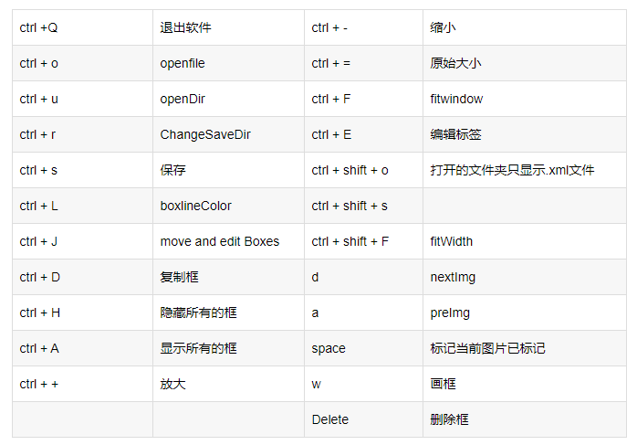

# 配置指南

## 目录
1. [Windows 端配置指南](#windows-端配置指南)
   - [NVIDIA 驱动安装与更新](#一-nvidia-驱动安装与更新)
   - [安装 CUDA 和 cuDNN](#二-安装-cuda-和-cudnn)
   - [Anaconda 的安装](#三-anaconda-的安装)
   - [PyTorch 环境安装](#四-pytorch-环境安装)
   - [PyCharm 安装](#五-pycharm-安装)
   - [LabelImg 安装及使用](#六-labelimg-安装及使用)
   - [项目克隆和环境依赖安装](#七-项目克隆和环境依赖安装)
2. [虚拟机端配置指南](#虚拟机端配置指南)
   - [安装 SDK Manager](#一-安装-sdk-manager)
3. [Jetson 端配置指南](#jetson-端配置指南)
   - [M.2 挂载](#一-m2-挂载)
   - [rootOnNVMe](#二-rootonnvme)
   - [fishros](#三-fishros)
   - [pip](#四-pip)
   - [jtop](#五-jtop)
   - [输入法](#六-输入法)
   - [摄像头](#七-摄像头)
   - [swap](#八-swap)
   - [VNC](#九-vnc)
   - [Jupyter-lab](#十-jupyter-lab)
4. [其他工具安装](#十一-其他工具安装)
   - [NoMachine](#1-nomachine)
   - [ToDesk](#2-todesk)
5. [无人机相关配置](#十二-无人机相关配置)
   - [MAVROS](#1-mavros)
   - [RealSense](#2-realsense)
   - [RealSense-ROS](#3-realsense-ros)
   - [Ego-Planner](#4-ego-planner)
   - [ROS 分布式通信](#5-ros-分布式通信)
6. [Deepstream-YOLO](#十三-deepstream-yolo)
   - [PyTorch](#1-pytorch)
   - [torchvision (v0.9.0)](#2-torchvision-v090)
   - [清华源](#3-清华源)
   - [YOLOv5 (v6.2)](#4-yolov5-v62)
   - [TensorRTX (YOLOv5 v6.2)](#5-tensorrtx-yolov5-v62)
   - [Deepstream 6.0.1](#6-deepstream-601)

---


## Windows 端配置指南

### 一、NVIDIA 驱动安装与更新

1. **查看显卡版本**  
   首先查看电脑的显卡版本。  
     
   如果已有显卡驱动，可以直接在桌面右键，找到英伟达驱动控制面板打开。  
     
   显卡驱动的下载地址：[NVIDIA GeForce 驱动程序](https://www.nvidia.com/Download/index.aspx)  
   

2. **检查驱动版本**  
   安装（更新）好显卡驱动后，按下 `Win + R` 组合键，打开命令窗口，输入以下命令：
   ```bash
   nvidia-smi
   ```
   例如，可以看到驱动版本为 `555.99`，最高支持的 CUDA 版本为 `12.5`。  
   

### 二、安装 CUDA 和 cuDNN

1. **下载 CUDA Toolkit**  
   下载地址：[CUDA Toolkit 12.8 Update 1](https://developer.nvidia.com/cuda-downloads)  
   

2. **下载 cuDNN**  
   下载地址：[cuDNN 9.2.1](https://developer.nvidia.com/cudnn)  
     
   将 zip 文件解压。

### 三、Anaconda 的安装

1. **下载 Anaconda**  
   官网下载地址：[Anaconda Distribution](https://www.anaconda.com/products/individual)

2. **安装步骤**  
   - 下载安装程序并运行。
   - 按照提示完成安装（安装在默认路径）。

### 四、PyTorch 环境安装

1. **创建虚拟环境**  
   打开 Anaconda 终端，创建虚拟环境：
   ```bash
   conda create -n yolov5 python=3.8
   ```
   此处虚拟环境名为 `yolov5`，Python 版本为 `3.8`。

2. **激活虚拟环境**  
   ```bash
   conda activate yolov5
   ```

3. **配置清华源（可选）**  
   如果需要加速下载，可以将 Anaconda 源切换为清华源：
   ```bash
   conda config --add channels https://mirrors.tuna.tsinghua.edu.cn/anaconda/pkgs/free/
   conda config --add channels https://mirrors.tuna.tsinghua.edu.cn/anaconda/pkgs/main/
   conda config --add channels https://mirrors.tuna.tsinghua.edu.cn/anaconda/cloud/pytorch/
   conda config --set show_channel_urls yes
   ```
   查看源：
   ```bash
   conda config --show
   ```
   恢复默认源：
   ```bash
   conda config --remove-key channels
   ```

4. **安装 PyTorch**  
   根据显卡支持的 CUDA 版本（如 CUDA 12.1），安装 PyTorch：
   ```bash
   conda install pytorch==2.3.1 torchvision==0.18.1 torchaudio==2.3.1 pytorch-cuda=12.1 -c pytorch -c nvidia
   ```
   如果可以尝试使用国内源：
   ```bash
   conda install pytorch torchvision torchaudio pytorch-cuda=12.1
   ```

5. **测试 PyTorch**  
   在 Python 中运行以下代码测试 PyTorch、CUDA 和 cuDNN 是否正常工作：
   ```python
   import torch
   print(torch.cuda.is_available())
   print(torch.backends.cudnn.is_available())
   print(torch.cuda_version)
   print(torch.backends.cudnn.version())
   ```

### 五、PyCharm 安装

1. **下载 PyCharm**  
   官网下载地址：[JetBrains PyCharm](https://www.jetbrains.com/pycharm/download/)

2. **安装步骤**  
   - 下载安装 PyCharm Community Edition 并运行（安装在默认路径）。
   - 按照提示完成安装。

### 六、LabelImg 安装及使用

1. **安装 LabelImg**  
   使用以下命令安装：
   ```bash
   pip install labelimg -i https://pypi.tuna.tsinghua.edu.cn/simple
   ```
   安装的路径为"C:\Users\ASUS\anaconda3\Scripts\labelImg.exe"

   解释如下：

   

   设置(标签格式为YOLO)

   

   打开需要标注的图片文件夹，设置标注文件保存的目录(Change Save Dir)

   

   开始标注，画框，标记目标的label

   

   labelimg的快捷键
   
   


### 七、项目克隆和环境依赖安装

1. **YOLOv5 项目**  
   - 克隆仓库：
     ```bash
     git clone https://github.com/ultralytics/yolov5.git
     ```
   - 安装依赖：
     ```bash
     cd yolov5
     pip install numpy==1.23.5 pillow==9.5
     pip install -r requirements.txt
     ```

---

## 虚拟机端配置指南

### 一、安装 SDK Manager

- 使用虚拟机 Ubuntu 18.04/20.04 系统，下载 SDK Manager。
- 使用前请先注册/登录 NVIDIA 账号。
- 下载的 `.deb` 文件：
  ```bash
  sudo dpkg -i sdkmanager*
  ```

---

## Jetson 端配置指南

### 一、M.2 挂载

- 如果板卡上的 eMMC 比较小，推荐外接一个 SSD。
- 部分板卡没有 eMMC，用的是 SD 卡，如果 SD 卡够用则不需要使用 SSD。
- 检查挂载情况：
  ```bash
  df -h
  sudo fdisk -l
  ```

### 二、rootOnNVMe

- 将 SD 卡转存到 SSD，并以 SSD 启动系统：
  ```bash
  git clone https://github.com/jetsonhacks/rootOnNVMe.git
  cd rootOnNVMe/
  ./copy-rootfs-ssd.sh
  ./setup-service.sh
  sudo reboot
  df -h
  ```

### 三、fishros

- 安装 fishros：
  ```bash
  wget http://fishros.com/install -O fishros && . fishros
  ```

### 四、pip

- 检查 Python 版本：
  ```bash
  python3 --version
  ```
- 安装相关依赖：
  ```bash
  sudo apt install python3-pip python3-dev build-essential libssl-dev libffi-dev python3-setuptools
  ```
- 检查 pip 版本并升级：
  ```bash
  pip3 --version
  sudo pip3 install --upgrade pip
  # sudo pip3 install pip==21.3.1
  ```

### 五、jtop

- jtop 是 Jetson 系列设备最佳设备状态监控软件，可以实时查看 CPU、GPU、内存等硬件设备使用情况，开发环境配置情况，同时可以直接在图形化界面设置运行功率和风扇转速。
- 安装步骤：
  ```bash
  sudo apt install python3-pip
  sudo -H pip3 install -U jetson-stats
  reboot
  jtop
  ```

### 六、输入法

- 安装输入法：
  ```bash
  sudo apt-get install ibus ibus-clutter ibus-gtk ibus-gtk3 ibus-qt4
  im-config -s ibus
  sudo apt-get install ibus-pinyin
  ibus-setup
  ```

### 七、摄像头

- 安装 v4l-utils：
  ```bash
  sudo apt install v4l-utils
  ```
- 检查摄像头设备：
  ```bash
  v4l2-ctl --list-devices
  v4l2-ctl --device=/dev/video0 --list-formats-ext
  ```

### 八、swap

- 新增 swapfile 文件大小自定义（6G）：
  ```bash
  sudo fallocate -l 6G /var/swapfile
  ```
- 配置文件权限：
  ```bash
  sudo chmod 600 /var/swapfile
  ```
- 建立交换分区：
  ```bash
  sudo mkswap /var/swapfile
  ```
- 启用交换分区：
  ```bash
  sudo swapon /var/swapfile
  ```
- 自启动启用：
  ```bash
  sudo bash -c 'echo "/var/swapfile swap swap defaults 0 0" >> /etc/fstab'
  ```

### 九、VNC

- 安装 VNC：
  ```bash
  sudo apt update
  sudo apt install vino
  ```
- 配置 VNC server：
  ```bash
  gsettings set org.gnome.Vino prompt-enabled false
  gsettings set org.gnome.Vino require-encryption false
  ```
- 编辑 org.gnome，恢复丢失的“enabled”参数：
  ```bash
  sudo vi /usr/share/glib-2.0/schemas/org.gnome.Vino.gschema.xml
  ```
  添加以下内容：
  ```xml
  <key name='enabled' type='b'>
      <summary>Enable remote access to the desktop</summary>
      <description>
           If true, allows remote access to the desktop via the RFB
           protocol. Users on remote machines may then connect to the
           desktop using a VNC viewer.
       </description>
       <default>false</default>
  </key>
  ```
- 设置为 Gnome 编译模式：
  ```bash
  sudo glib-compile-schemas /usr/share/glib-2.0/schemas
  ```
- 手动启动：
  ```bash
  /usr/lib/vino/vino-server
  ```
- 设置 VNC 登陆密码：
  ```bash
  gsettings set org.gnome.Vino authentication-methods "['vnc']"
  gsettings set org.gnome.Vino vnc-password $(echo -n 'thepassword'|base64)
  sudo reboot
  ```
- 开机自启动 VNC Server：
  ```bash
  gsettings set org.gnome.Vino enabled true
  ```
- 创建自启动文件：
  ```bash
  mkdir -p ~/.config/autostart
  vi ~/.config/autostart/vino-server.desktop
  ```
  添加以下内容：
  ```ini
  [Desktop Entry]
  Type=Application
  Name=Vino VNC server
  Exec=/usr/lib/vino/vino-server
  NoDisplay=true
  ```

### 十、Jupyter-lab

#### 1. 安装

- 安装依赖：
  ```bash
  sudo apt install nodejs npm
  sudo apt install libffi-dev
  sudo pip3 install jupyter jupyterlab
  ```

#### 2. 生成配置文件

- 生成配置文件：
  ```bash
  jupyter notebook --generate-config
  ```

#### 3. 修改配置文件

- 修改配置文件：
  ```bash
  sudo gedit ~/.jupyter/jupyter_notebook_config.py
  ```
  修改以下内容：
  ```python
  c.NotebookApp.ip = '0.0.0.0'  # 第296行
  c.NotebookApp.open_browser = False  # 第400行
  c.NotebookApp.port = 8888  # 第424行，开放的端口号
  c.NotebookApp.notebook_dir = '/home/'  # 第392行，可以访问的目录
  ```

#### 4. 设置访问密码

- 设置密码：
  ```bash
  jupyter notebook password
  ```

#### 5. 启动 Jupyter Notebook

- 启动 Jupyter Notebook：
  ```bash
  jupyter notebook
  ```

#### 6. 开机自启动

- 查找 Jupyter-lab 安装位置：
  ```bash
  which jupyter-lab
  ```
- 创建 `jupyter.service` 文件：
  ```bash
  sudo gedit /etc/systemd/system/jupyter.service
  ```
  添加以下内容：
  ```ini
  [Unit]
  Description=Jupyter Notebook

  [Service]
  Type=simple
  User=fs  # 需要更换为自己的用户名
  ExecStart=/home/fs/.local/bin/jupyter-lab --port 8888  # 更换为自己的路径
  WorkingDirectory=/home/  # notebook 启动时的目录

  [Install]
  WantedBy=default.target
  ```
- 启动服务：
  ```bash
  sudo systemctl enable jupyter
  sudo systemctl start jupyter
  ```
- 查看当前 IP：
  ```bash
  ifconfig
  ```
- 重启：
  ```bash
  sudo reboot
  ```
- 等待重启完成，在同局域网下，通过浏览器访问 Ubuntu：`ip:端口号/lab`

### 十一、其他工具安装

#### 1. NoMachine

- **ARMv8**  
  下载地址：[NoMachine ARMv8](https://downloads.nomachine.com/linux/?distro=Arm&id=30)  
  安装命令：
  ```bash
  sudo dpkg -i nomachine*
  ```

#### 2. ToDesk

- **ARM64 & aarch64**  
  下载地址：[ToDesk Linux 版](https://www.todesk.com/linux.html)  
  安装命令：
  ```bash
  sudo apt-get install libappindicator3-1
  sudo apt-get install ./todesk*
  ```

### 十二、无人机相关配置

#### 1. MAVROS

- MAVROS 是一层 MAVLink 与 ROS 通信的封装，旨在方便无人机与机载电脑通信。
  ```bash
  sudo apt-get install ros-noetic-mavros-*
  sudo apt-get install ros-noetic-serial
  cd /opt/ros/noetic/lib/mavros
  sudo ./install_geographiclib_datasets.sh
  ```

- 修改 launch 文件：
  ```bash
  sudo chmod 777 /opt/ros/noetic/share/mavros/launch/px4.launch
  sudo gedit /opt/ros/noetic/share/mavros/launch/px4.launch
  ```
  将其中的：
  ```xml
  <arg name="fcu_url" default="/dev/ttyACM0:57600" />
  ```
  修改为：
  ```xml
  <arg name="fcu_url" default="/dev/ttyACM0:921600" />
  ```

- 插上飞控查看 MAVROS 对应的串口号：
  ```bash
  ls /dev/tty*
  ```
  给予相应的权限：
  ```bash
  sudo chmod 777 /dev/ttyACM0
  ```
  启动 MAVROS：
  ```bash
  roslaunch mavros px4.launch
  ```

#### 2. RealSense

- 安装依赖(jetson)：
  ```bash
  sudo cp /home/nx/drone/doc/d435/libuvc_installation_jetson.sh /home/nx/libuvc_installation_jetson.sh
  sudo chmod +x ./libuvc_installation_jetson.sh
  ./libuvc_installation_jetson.sh
  sudo rm libuvc_installation_jetson.sh
  ```
- 安装依赖(orangepi5max/ultra-RK3588)：
  ```bash
  sudo cp /home/nx/drone/doc/d435/libuvc_installation_rk3588.sh /home/nx/libuvc_installation_rk3588.sh
  sudo chmod +x ./libuvc_installation_rk3588.sh
  ./libuvc_installation_rk3588.sh
  sudo rm libuvc_installation_rk3588.sh
  ```
- 测试 RealSense：
  ```bash
  realsense-viewer
  ```
  注意：测试时左上角显示的 USB 必须是 3.x，如果是 2.x，可能是 USB 线是 2.0 的，或者插在了 2.0 的 USB 口上（3.0 的线和口都是蓝色的）。

#### 3. RealSense-ROS

- 在已经建立好的工作空间中加入RealSense-ROS
- 安装：
  ```bash
  cd src
  git clone -b ros1-legacy https://github.com/IntelRealSense/realsense-ros.git
  git clone https://github.com/pal-robotics/ddynamic_reconfigure.git
  cd ..
  catkin_make
  sudo make install
  sudo apt-get install ros-noetic-ddynamic-reconfigure
  sudo apt-get install ros-noetic-rgbd-launch
  sudo apt-get install ros-noetic-realsense2-camera-*

  ```

- 添加环境依赖：
  ```bash
  echo "source ~/catkin_ws/devel/setup.bash" >> ~/.bashrc
  source ~/.bashrc
  ```

- 测试安装是否成功：
  ```bash
  roslaunch realsense2_camera demo_pointcloud.launch
  ```

- 查看发布的topic
  ```bash
  rostopic list
  ```

#### 4. Ego-Planner

- 克隆项目：
  ```bash
  git clone https://github.com/ZJU-FAST-Lab/Fast-Drone-250
  cd Fast-Drone-250
  unzip 3rd_party.zip
  ```

- 安装依赖：
  ```bash
  cd glog
  sudo chmod 777 *
  ./autogen.sh && ./configure && make && sudo make install
  sudo apt-get install liblapack-dev libsuitesparse-dev libcxsparse3 libgflags-dev libgoogle-glog-dev libgtest-dev
  cd ..
  ```

- 编译 Ceres Solver：
  ```bash
  sudo mv ceres-solver-2.0.0rc1 ceres
  cd ceres
  mkdir build
  cd build
  cmake ..
  sudo make -j4
  sudo make install
  cd ..
  ```

- 编译工作空间：
  ```bash
  catkin_make
  source devel/setup.bash
  roslaunch ego_planner single_run_in_sim.launch
  ```

- 更改 IMU 话题频率（非常重要，如果没更改会导致 VINS 发散）：
  - 进入到工作空间下 `shfiles` 文件夹，打开 `rspx4.sh`，在 `roslaunch mavros px4.launch` 之后的 `& sleep` 改成 `10`（等待 10 秒，给启动节点预留足够时间），然后后面添加两行：
    ```bash
    rosrun mavros mavcmd long 511 105 4000 0 0 0 0 0 & sleep 3
    rosrun mavros mavcmd long 511 31 4000 0 0 0 0 0 & sleep 3
    ```

#### 5. ROS 分布式通信

- 安装依赖：
  ```bash
  sudo apt install net-tools
  ```

- 配置主机和从机的 IP 地址（以 OrangePi 为例）：

  - 在 OrangePi 和虚拟机终端上：
    ```bash
    ifconfig  # 查看 IP
    hostname  # 查看计算机名称
    ```

  - 在 OrangePi 上：
    ```bash
    ping 192.168.**.**
    sudo gedit /etc/hosts
    ```
    如果没有 `gedit`，请在文件管理器中找到该文件，然后运行以下命令：
    ```bash
    sudo chmod 777 hosts
    ```
    添加一行：
    ```plaintext
    192.168.**.** 虚拟机用户名
    ```
    测试：
    ```bash
    ping 虚拟机用户名
    ```

  - 在虚拟机上：
    ```bash
    ping 192.168.**.**  # 测试 OrangePi
    sudo vim /etc/hosts
    ```
    添加一行：
    ```plaintext
    192.168.**.** orangepi
    ```
    测试：
    ```bash
    ping orangepi
    ```

- 配置主机的 IP 地址：
  - 在 OrangePi 端：
    ```bash
    sudo vim ~/.bashrc
    ```
    在最后一行加入以下代码：
    ```bash
    export ROS_MASTER_URI=http://主机IP:11311
    export ROS_HOSTNAME=主机IP
    ```
    保存并退出：
    ```bash
    :wq
    ```
    应用更改：
    ```bash
    source ~/.bashrc
    ```

  - 在虚拟机端：
    ```bash
    sudo vim ~/.bashrc
    ```
    在最后一行加入以下代码：
    ```bash
    export ROS_MASTER_URI=http://主机IP:11311
    export ROS_HOSTNAME=从机IP
    ```
    保存并退出：
    ```bash
    :wq
    ```
    应用更改：
    ```bash
    source ~/.bashrc
    ```

#### 6. livox

- 安装Livox-SDK2：
  ```bash
  git clone https://github.com/Livox-SDK/Livox-SDK2.git
  cd ./Livox-SDK2/
  mkdir build
  cd build
  cmake .. && make -j4
  sudo make install
  ```

- 安装依赖：
  ```bash
  sudo cp /home/nx/drone/doc/livox/ws_livox /home/nx/drone/ws_livox
  cd ws_livox/src/livox_ros_driver2
  sudo chmod 777 build.sh
  ./build.sh ROS1
  ```


### 十三、Deepstream-YOLO

#### 1. PyTorch

- 安装依赖：
  ```bash
  sudo apt-get install python3-pip libopenblas-base libopenmpi-dev
  pip3 install Cython
  pip3 install numpy==1.19.3
  pip3 install protobuf==3.3.0
  pip3 install torch-1.8.0-cp36-cp36m-linux_aarch64.whl
  ```

#### 2. torchvision (v0.9.0)

- 安装依赖：
  ```bash
  sudo apt-get install libjpeg-dev zlib1g-dev libpython3-dev libavcodec-dev libavformat-dev libswscale-dev
  python3 -m pip install --upgrade pillow
  ```
- 克隆并安装：
  ```bash
  git clone --branch v0.9.0 https://github.com/pytorch/vision torchvision
  cd torchvision
  export BUILD_VERSION=0.9.0
  python3 setup.py install --user
  ```

#### 3. 清华源

- 使用清华源安装 Python 包：
  ```bash
  pip install numpy -i https://pypi.tuna.tsinghua.edu.cn/simple
  ```

#### 4. YOLOv5 (v6.2)

- 安装依赖：
  ```bash
  pip install testresources
  pip install launchpadlib
  ```
- 克隆并安装：
  ```bash
  git clone -b v6.2 https://github.com/ultralytics/yolov5.git
  pip install -r requirements.txt
  ```

#### 5. TensorRTX (YOLOv5 v6.2)

- 克隆并编译：
  ```bash
  git clone -b yolov5-v6.2 https://github.com/wang-xinyu/tensorrtx.git
  cd tensorrtx
  mkdir build
  cd build
  cmake ..
  make
  # 修改 yololar.h 中的 class_num
  ```

#### 6. torchvision (v0.9.0)

- 安装依赖：
  ```bash
  sudo apt-get install libjpeg-dev zlib1g-dev libpython3-dev libavcodec-dev libavformat-dev libswscale-dev
  python3 -m pip install --upgrade pillow
  ```
- 克隆并安装：
  ```bash
  git clone --branch v0.9.0 https://github.com/pytorch/vision torchvision
  cd torchvision
  export BUILD_VERSION=0.9.0
  python3 setup.py install --user
  ```

#### 7. Deepstream 6.0.1

- **第一种**：用 TensorRT 转换 wts 和 cfg，使用这个版本的 DeepStream-YOLO  
  使用脚本生成权重文件：
  ```bash
  # gen_wts_yolov5.py
  ```
  [DeepStream-Yolo](https://github.com/marcoslucianops/DeepStream-Yolo/tree/e652ef4e394fbcee0b8b8652c4630802bec4eab3)

- **第二种**：使用 ONNX  
  克隆仓库：
  ```bash
  git clone https://github.com/marcoslucianops/DeepStream-Yolo.git
  ```
  配置文件：`config_infer_primary_yoloV5.txt`  
  ONNX 模型文件：
  ```ini
  onnx-file=yolov5s.onnx
  ```
  生成的引擎文件：
  ```ini
  model-engine-file=model_b1_gpu0_fp32.engine
  ```
  标签文件：
  ```ini
  labelfile-path=labels.txt
  ```
  置信度：
  ```ini
  pre-cluster-threshold=0.25
  ```
  配置文件：`deepstream_app_config.txt`
  ```ini
  [source0]
  enable=1
  type=3
  uri=file:///opt/nvidia/deepstream/deepstream/samples/streams/sample_1080p_h264.mp4
  num-sources=1
  gpu-id=0
  cudadec-memtype=0

  [primary-gie]
  config-file=config_infer_primary_yoloV5.txt
  ```

#### 8. Deepstream-python